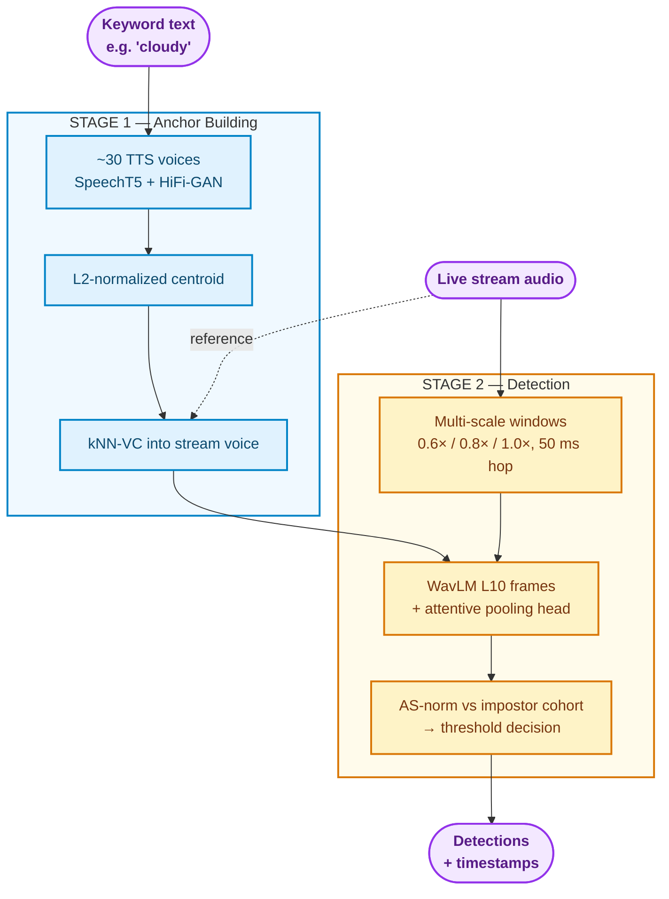

# Siamese VMS - Zero-Shot Keyword Spotting in Live Video Streams

## What This Project Does

Give the system a **word** and a **live video/audio stream**, and it tells
you when that word gets spoken — without running full speech-to-text on the
live feed, and without any recording of that word in that exact voice.

You type a keyword like `"cloudy"`. The system:
1. **Imagines** how that word sounds using text-to-speech (~30 synthetic voices).
2. **Repaints** that sound into the stream's own voice (kNN-VC voice conversion).
3. **Scans** live audio in sliding windows and scores each against the keyword
   embedding with Adaptive S-norm (AS-norm).
4. **Flags** windows whose score crosses a per-keyword calibrated threshold.

The result: zero-shot keyword spotting on live news audio — no enrollment
recording, no live ASR pass, no retraining per stream.

For a GUI that monitors a YouTube URL in real time, see
[`platform/README.md`](platform/README.md) (`python platform/gui.py`).

## Why This Is Hard (The Core Problem)

Raw TTS compared directly to human speech mostly fails: a synthetic voice and
a real voice land in different regions of embedding space even when saying
the same word. We call this the **synthetic-to-real domain gap** — it was
the single biggest early failure mode (F1 = 0.00 on conversational speech
with a raw TTS anchor; see
[reports/EXPERIMENT_LOG.md](reports/EXPERIMENT_LOG.md)).

Two fixes stack on each other:
- **Stage 1 (kNN-VC)** moves the anchor into the stream's acoustic domain.
- **Stage 2 (trained detector head)** lifts real-speech scores so true keyword
  windows cross the calibrated threshold directly — no third verification stage.

## How It Works: The Two-Stage Pipeline



### Stage 1: Anchor Building (Bridging the Domain Gap)

**Intuition:** synthesize the keyword, then re-voice it with real stream audio
so the anchor lives in the same acoustic world as the broadcast.

**Technical:** `pipeline/keyword_generator.py` builds a multi-voice TTS
prototype (SpeechT5 + HiFi-GAN: CMU ARCTIC speakers, random x-vectors, and
cross-speaker blends), augments clips, embeds them, and averages a centroid.
`pipeline/convert_anchor_knnvc.py` runs each clip through
**[kNN-VC](https://github.com/bshall/knn-vc)** (WavLM + kNN regression +
prematched HiFi-GAN), using non-keyword stream chunks as the reference pool
(transcript-checked, so keyword-bearing chunks are excluded).

### Stage 2: Detection (WavLM + Attentive Head + AS-norm)

**Intuition:** slide windows across each chunk, score similarity to the
anchor, normalize against impostors, and accept windows above a threshold
fit on keyword-free stream audio.

**Production backend** (`SIAMESE_BACKEND=wavlm-trained`, default weights
`checkpoints/siamese_v3_best.pth`):

- **Backbone:** frozen `microsoft/wavlm-base-plus`, **layer 10** frame features
  (word identity peaks in mid layers, not the last layer).
- **Head:** trained attentive pooling + projection
  (`core/embedders.py`, `training/train_siamese_v3.py`) — sub-center ArcFace
  over MSWC + TTS bank with phonetic-confusable batches.
- **Scoring:** cosine similarity → **Adaptive S-norm** against a per-keyword
  cohort (`pipeline/cohort_builder.py`):

$$
s_{\text{norm}} = \frac{1}{2}\left(\frac{s - \mu_a}{\sigma_a} + \frac{s - \mu_w}{\sigma_w}\right)
$$

- **Detector:** `pipeline/detector.py` — multi-scale windows, 50 ms hop
  (must match calibration). Frame backends embed each chunk with one forward
  pass and pool windows from contextualized frames (~100× faster than
  per-window embedding).
- **Threshold:** `pipeline/calibrate.py` — max score on keyword-free windows
  embedded through the **same detector protocol** (chunk context, all scales,
  50 ms grid). Defaults to `--fa-percentile 100 --negatives 40000` (the
  trained-head operating point); negatives are drawn only from chunks that do
  not contain the keyword (transcript token check).

**Legacy baseline** (`SIAMESE_BACKEND=baseline`): frozen `wav2vec2-base` +
Phase-1 linear projection head (`core/siamese_model.py`,
`checkpoints/siamese_v1_best.pth`). Kept for comparison; not the production path.

## Does It Actually Work?

Set D validation (Sky News weather bulletin, 10 unique chunks,
`audios/transcripts.txt` ground truth) with `wavlm-trained` and aligned
p100 calibration:

| Keyword | Difficulty | Precision | Recall | F1 |
|---|---|---|---|---|
| russia | rare (1 chunk) | 1.00 | 1.00 | 1.00 |
| weather | rare (1 chunk) | 1.00 | 1.00 | 1.00 |
| scotland | frequent (3 chunks) | 1.00 | 1.00 | 1.00 |
| ireland | frequent (3), near-homophone ("Island") | 1.00 | 1.00 | 1.00 |
| brighten | rare (1 chunk) | 1.00 | 1.00 | 1.00 |
| **Micro-avg (50 decisions)** | | **1.00** | **1.00** | **1.00** |

Additional ad-hoc runs (same chunk set): `cloudy` (2 true chunks) F1 = 1.00;
`outbreaks` F1 = 0.67 (one chunk-boundary FN documented in the experiment log).

Full history, ablations, and failure analyses:
[reports/EXPERIMENT_LOG.md](reports/EXPERIMENT_LOG.md),
[reports/SIAMESE_PROGRESS_REPORT.md](reports/SIAMESE_PROGRESS_REPORT.md).

Pipeline parameter defaults (voice count, holdout, stream-window count, TTS
distractors) come from a one-at-a-time ablation over the same Set D keywords:
`ablation_study/` — the `combined_best` config cuts wall time ~70% vs. the
original search-time defaults with no F1 loss (`ablation_study/results/`).

## Configuration

Set these before running the pipeline (PowerShell example):

```powershell
$env:SIAMESE_BACKEND = "wavlm-trained"
$env:SIAMESE_WEIGHTS = "checkpoints/siamese_v3_best.pth"
```

| Variable | Default | Purpose |
|---|---|---|
| `SIAMESE_BACKEND` | `baseline` | `wavlm-trained` (production), `wavlm`, or `baseline` |
| `SIAMESE_WEIGHTS` | `checkpoints/siamese_v3_best.pth` | Checkpoint for baseline backend |
| `SIAMESE_V3_WEIGHTS` | `checkpoints/siamese_v3_best.pth` | Attentive-head weights for `wavlm-trained` |
| `SIAMESE_PROJECT_ROOT` | project root | Redirect all data paths (used by `platform/`) |
| `SIAMESE_BACKBONE` | `microsoft/wavlm-base-plus` | SSL model for WavLM backends |
| `SIAMESE_LAYER` | `10` | Transformer layer for frame features |

Non-baseline backends write suffixed artifacts (e.g.
`keywords/cloudy_anchor_wavlm10ft.npz`) so runs do not overwrite each other.

## Project Layout

```
Siamese_VMS_Project/
├── core/           siamese_model.py (Phase-1 head), embedders.py (WavLM backends),
│                   scoring.py (AS-norm, paths, backends), augment_utils.py
├── pipeline/       offline research pipeline (run order below)
├── platform/       live YouTube monitoring GUI (isolated under platform/data/)
├── training/       AWS training scripts: v1 triplet, v2 GRL, v3 attentive head
├── checkpoints/    siamese_v1_best.pth, siamese_v2_best.pth, siamese_v3_best.pth
├── keywords/       generated anchors, cohorts, calibrations (gitignored, rebuildable)
├── audios/ videos/ Set D chunks + transcripts.txt (ground truth)
├── logs/           detection JSON + archive of historical runs
└── reports/        experiment log + progress report
```

### Pipeline scripts (run from project root)

| Step | Script | Output |
|---|---|---|
| 1 | `downloader.py` | `audios/`, `videos/` |
| 2 | `transcribe_chunks.py` | `audios/transcripts.txt` |
| 3 | `keyword_generator.py` | TTS anchor + variants |
| 4 | `convert_anchor_knnvc.py` | kNN-VC anchor (recommended) |
| 5 | `cohort_builder.py` | `cohort_<kw>*.npz` |
| 6 | `calibrate.py` | `*_calibration*.json` |
| 7 | `detector.py` | `logs/detections_<kw>.json` |
| 8 | `validate_detection.py` | P / R / F1 vs transcripts |

## Model Training (Offline, AWS)

Three training generations live under `training/`:

| Phase | Script | What it trains | Checkpoint |
|---|---|---|---|
| 1 | `train_siamese_v1.py` | wav2vec2-base (frozen) + linear projection head, triplet loss on MSWC | `siamese_v1_best.pth` |
| 2 | `train_siamese_v2.py` | Same backbone + GRL domain adversary on the head (did not fix ranking inversions) | `siamese_v2_best.pth` |
| 3 | `train_siamese_v3.py` | **Attentive pooling head** on frozen WavLM L10, sub-center ArcFace, phonetic-confusable batches | `siamese_v3_best.pth` |

Launch helpers: `deploy_phase1.ps1`, `deploy_phase2.ps1`, `deploy_phase3.ps1`.

## Usage Guide

Run from the project root. Pass `--keyword` explicitly (or create
`selected_keyword.txt` in the project root).

```powershell
cd Siamese_VMS_Project
$env:SIAMESE_BACKEND = "wavlm-trained"
$env:SIAMESE_WEIGHTS = "checkpoints/siamese_v3_best.pth"
```

1. **Download stream chunks** (content-hash dedup):
   ```bash
   python pipeline/downloader.py
   ```
2. **Transcribe chunks** (ground truth for validation + kNN-VC exclusion):
   ```bash
   python pipeline/transcribe_chunks.py
   ```
3. **TTS prototype anchor** (7 canonical voices, holdout 4 — defaults tuned by
   `ablation_study/`, no accuracy loss vs. the original 17-voice search):
   ```bash
   python pipeline/keyword_generator.py --keyword cloudy
   ```
4. **kNN-VC anchor conversion** (closes the domain gap):
   ```bash
   python pipeline/convert_anchor_knnvc.py --keyword cloudy
   ```
5. **Impostor cohort** (50 stream windows, TTS distractors off by default):
   ```bash
   python pipeline/cohort_builder.py --keyword cloudy
   ```
6. **Calibrate threshold** (aligned detector protocol, keyword-free negatives):
   ```bash
   python pipeline/calibrate.py --keyword cloudy
   ```
7. **Detect:**
   ```bash
   python pipeline/detector.py --keyword cloudy
   ```
8. **Validate:**
   ```bash
   python pipeline/validate_detection.py --keyword cloudy
   ```

## Related Approaches in This Repo

| Folder | Method |
|---|---|
| `Correlation_VMS_Project/` | Original TTS + cross-correlation baseline |
| `PhonMatchNet_VMS_Project/` | G2P open-vocabulary phoneme matching (no audio anchor) |
| **Siamese_VMS_Project/** | This project — Siamese embedding + kNN-VC + WavLM detector |
