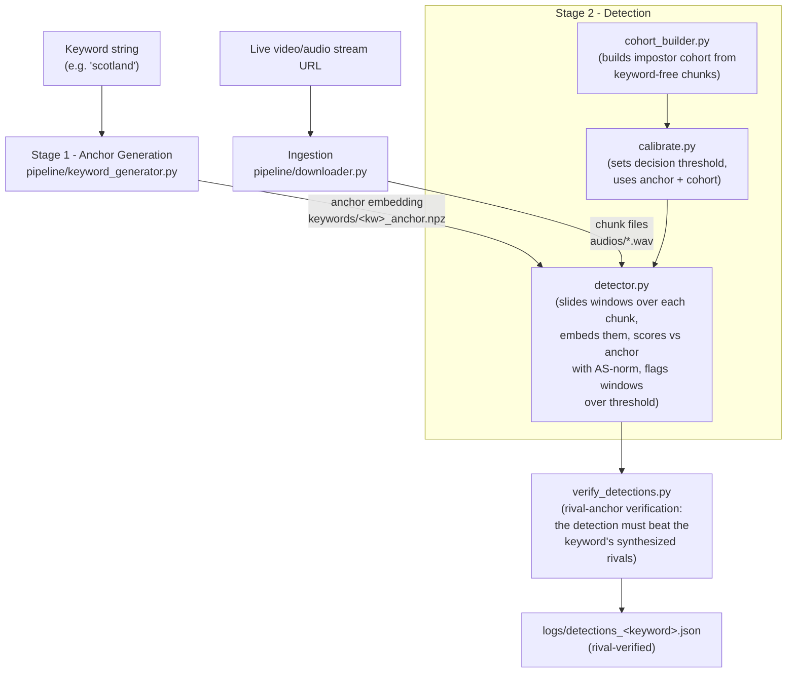
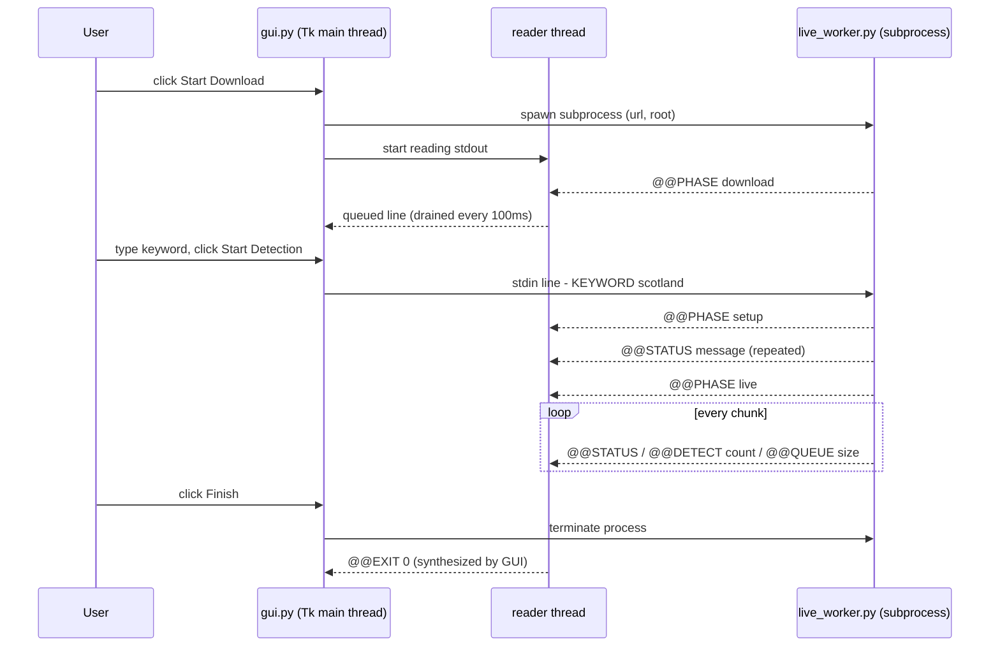
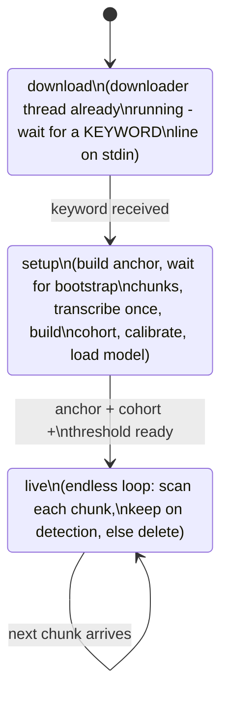
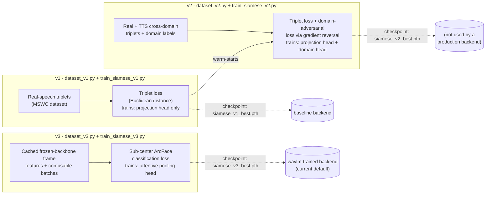

# Siamese VMS - Architecture & Pipeline Guide

*A beginner-friendly walkthrough of how this keyword-spotting system is built, from raw audio in to a detection decision out. This document describes mechanics only - what each piece does and how data flows between pieces - not how well anything performs.*

---

## 1. What problem is this solving?

The goal is: **given a live video/audio stream and a single spoken keyword (e.g. "scotland"), automatically notice every moment the stream says that word.**

The obvious approach would be "run speech-to-text on everything, then search the transcript for the word." This project deliberately does **not** do that as its main mechanism. Instead, it works by **audio similarity**: it builds one reference recording of what the keyword *sounds like* (called an **anchor**), and then continuously asks "does this new snippet of audio sound like the anchor?" It's closer to fingerprint matching than to reading text.

Why avoid transcription as the main mechanism? Speech-to-text models are large, are tuned for general vocabulary, and can mis-hear rare or unusual words. A dedicated audio-similarity detector can be pointed at *exactly one* word and tuned specifically for that word's sound. (Speech-to-text is still used in this project - but only in a supporting role, e.g. building a ground-truth reference or guarding against a specific edge case. More on that later.)

---

## 2. The core idea, explained before any code

Everything in this project rests on a few ideas. If you're comfortable with these, the rest of the document will read naturally.

**Embeddings.** A neural network can turn a chunk of audio into a fixed-length list of numbers (a *vector*, e.g. 768 numbers) that captures "what this audio sounds like" in a way that's useful for comparison. Two recordings of similar sounds get similar vectors. This project always calls this vector an **embedding**.

**Cosine similarity.** If you have two embeddings, you need a number that says "how similar are these." The standard tool is *cosine similarity*: treat each embedding as an arrow (vector) in space, and measure the angle between the two arrows. Identical direction → similarity 1.0. Perpendicular → 0.0. Opposite → -1.0. In code, if both vectors are first scaled to length 1 (**L2-normalized**), cosine similarity is simply their dot product - this is why you'll see `l2_normalize()` called everywhere embeddings are produced.

**Frozen backbone.** Training a full speech neural network from scratch is expensive. Instead, this project takes an *already-trained* general-purpose speech model (WavLM or wav2vec2 - both learned generic speech structure from huge amounts of unlabeled audio) and **freezes** it - its weights never change. Only a small extra piece bolted on top (a "head") gets trained for this project's specific task. This is a very common and cheap way to specialize a large pretrained model.

**Anchor / prototype.** Since there's no single "correct" recording of a word, the project synthesizes the keyword in *many* different voices and averages their embeddings into one representative vector - the anchor. This average is also called a *centroid* or *prototype*.

**Sliding window.** A live audio chunk is a few seconds long, but the keyword might only occupy a fraction of a second somewhere inside it. So the detector doesn't embed the whole chunk once - it slides a window of roughly the keyword's own duration across the chunk (like a magnifying glass moving left to right) and embeds each window position separately, checking each one against the anchor.

**Cohort / calibration.** A raw similarity number (e.g. cosine 0.62) is meaningless by itself - is that "clearly the keyword" or "just a coincidence"? To answer that, the system builds a **cohort**: a batch of audio that is *not* the keyword (regular stream content), scores it too, and uses the resulting range of "impostor" scores to figure out where to draw the line. That line is the **threshold**. Setting it is called **calibration**.

With those five ideas in hand, here is the repository, and then the full pipeline.

---

## 3. Repository tour

```
Siamese_VMS_Project/
├── core/              shared library code, imported by everything else
│   ├── siamese_model.py   the legacy ("baseline") embedding model
│   ├── embedders.py       the WavLM-based embedding backends (current default)
│   ├── scoring.py         AS-norm scoring math, paths, config, env vars
│   ├── rival_verify.py    rival-anchor verification of detections
│   └── augment_utils.py   audio distortion effects (pitch/tempo/reverb/noise)
│
├── pipeline/          the offline, step-by-step research pipeline (run as scripts)
│   ├── downloader.py          stream → audio chunks on disk
│   ├── transcribe_chunks.py   chunks → transcripts.txt (Whisper)
│   ├── keyword_generator.py   keyword → anchor embedding (TTS-based)
│   ├── cohort_builder.py      → impostor cohort embeddings
│   ├── calibrate.py           → decision threshold
│   ├── detector.py            → scans chunks, writes detections
│   ├── rival_bank.py          → global TTS word bank (one-time per backend)
│   ├── rival_builder.py       → per-keyword rival anchors + accept margin
│   ├── verify_detections.py   → rival-verifies detections (precision)
│   └── validate_detection.py  compares detections against transcripts
│
├── platform/          the live-monitoring desktop app (wraps the pipeline above)
│   ├── gui.py            Tkinter front-end
│   └── live_worker.py    background worker: orchestration + live scan loop
│
├── training/          offline scripts that produced the model checkpoints
│   ├── tts_bank.py                 builds a large synthetic word-audio bank
│   ├── dataset_v1/v2/v3.py         three different training-data samplers
│   └── train_siamese_v1/v2/v3.py   three successive training recipes
│
├── ablation_study/    a parameter-sweep harness around the pipeline scripts
│
├── checkpoints/       trained model weight files (.pth)
├── keywords/          generated anchors/cohorts/calibration files (per keyword)
├── audios/            downloaded stream chunks + transcripts.txt
└── logs/              detection output
```

Almost every file in `pipeline/`, `platform/`, and `ablation_study/` imports from `core/` - `core/scoring.py` in particular is the hub that nearly everything else depends on.

---

## 4. The two production stages, at a glance



Both stages share the same embedding model (selected once via an environment variable, see §6) and the same set of file-naming conventions defined centrally in `core/scoring.py`. The verification step at the end re-checks each detection through a *relative* contest - it must out-score the keyword's own synthesized confusable words ("rival anchors") - because an absolute score alone can confuse similar-sounding words (§14.3 describes the mechanism; the same module gates the live platform's detections; the retired phone-CTC alternative is preserved on the archive/phone-verifier branch). The sections below walk through every box in this diagram in the order data actually flows, starting with how a keyword becomes an anchor.

---

## 5. Stage 1 - Building a keyword's "anchor" (`pipeline/keyword_generator.py`)

This script takes nothing but a keyword string and produces one embedding vector that represents "what this word sounds like."

**Step 1 - synthesize the word in many voices.** It uses Microsoft's **SpeechT5** text-to-speech model (plus its **HiFi-GAN** vocoder, which turns SpeechT5's internal representation into an actual waveform) to speak the keyword out loud, repeatedly, in different voices:
- **7 canonical voices** - fixed speaker identities from the `CMU ARCTIC` voice dataset (a public collection of "x-vectors," which are numeric voice-identity fingerprints that SpeechT5 uses to decide *who* is speaking).
- **`--n-random` extra voices** - random rows picked from the same voice dataset.
- **`--n-blend` "blended" voices** - two random voices are mixed together via linear interpolation, $\text{blend} = \alpha \cdot \text{voice}_1 + (1-\alpha) \cdot \text{voice}_2$ with $\alpha \sim \mathrm{Uniform}(0.3, 0.7)$. This produces a voice that doesn't correspond to any real speaker, widening the variety of "accents" the anchor has seen.

Each synthesized clip is cached to disk (`keywords/<keyword>_variants/`) so re-runs don't re-synthesize existing voices.

**Synthesis is seeded, and has to be.** SpeechT5 applies dropout in its speech-decoder prenet *at inference time by design* - a Tacotron 2 convention, implemented in `SpeechT5SpeechDecoderPrenet._consistent_dropout`, which calls `torch.bernoulli` directly rather than through `nn.Dropout`, so `model.eval()` does **not** switch it off. It therefore consumes torch's global random number generator. Because the pipeline originally seeded only NumPy, every render differed between runs, and that difference propagated the whole way down: different waveform, different silence-trim boundary, different `window_samples`, different centroid, different cohort window slicing, and - because rivals are ranked by embedding proximity - a different *rival word list*. Two from-scratch builds of the same keyword agreed on `keyword`, `delta`, `n_stream` and `n_tts` and disagreed on everything derived from audio.

`synthesize()` therefore calls `torch.manual_seed()` immediately before generating, with a seed derived from a SHA-256 hash of `(text, x-vector, TTS_SEED)`. Hashing the *inputs* rather than seeding once per process matters: a process-level seed would make clip *N* depend on how many clips preceded it, so changing `--n-augment` or the voice list would silently shift every later clip. With the per-call seed, each clip is reproducible independently of ordering, and a from-scratch rebuild on **one machine** reproduces all 15 arrays across the anchor, cohort and rival artifacts byte for byte.

**Qualified 2026-09-04, measured.** Across *different* machines that guarantee weakens. Two independent rebuilds of the same 14 keywords in separate Modal containers agreed on every calibrated threshold to three decimal places and on every chunk decision, but only 9 of the 14 were bit-identical; the other 5 differed by up to 0.001 in threshold and 0.0019 in per-chunk score. That is floating-point accumulation across different CPU hardware, not unseeded randomness - the pre-fix bug made two builds disagree on all 15 arrays with audibly different audio. Claim reproducible thresholds and decisions; do not claim bit-determinism across hardware. Evidence: `verify_determinism` in `benchmarks/libriphrase/modal_rebuild.py`, artifacts under `Journal_Paper/experiments/rebuild_2026_09_04/`.

Note that clips already cached on disk are *not* regenerated, so any keyword built before this change keeps its original (irreproducible) audio until its `_variants/` directory is removed. The 14 broadcast evaluation keywords had exactly that done on 2026-09-04: their pre-fix builds were discarded and replaced by seeded rebuilds, which are now the canonical artifacts.

**Step 2 - clean up degenerate synthesis.** TTS models occasionally fail - producing near-silence or a "babbling" repeated loop. The script trims silence from every clip, discards anything under 0.15 seconds, and also discards any clip whose length is more than $1.8\times$ the *median* clip length (a cheap way to catch runaway/looping synthesis without needing a human to check each one).

**Step 3 - augment.** Each surviving clean clip is copied `--n-augment` times (default 2) through `core/augment_utils.py`'s `augment_audio()` function, which randomly (each independently gated by its own coin-flip) applies:
- pitch shift ($\pm 1.5$ semitones),
- time-stretch ($0.88\times$-$1.12\times$ speed),
- a synthetic room echo (an artificial decaying-noise "impulse response" convolved with the signal, with a random reverberation time and wet/dry mix),
- a low-pass filter (simulating band-limited/telephone-like audio), and
- always: additive background noise at a randomized signal-to-noise ratio, followed by peak normalization.

This is meant to make clean TTS speech sound a bit more like messy real-world audio.

**Step 4 - split into "centroid" voices and "holdout" voices.** A random subset of voices (`--holdout`, default 4) is set aside - their embeddings become **positive** reference points used later during calibration (§9), never contributing to the anchor itself. The rest feed the anchor.

**Step 5 - embed and average.** Every remaining clip is converted to an embedding using the currently active model (see §6). The embeddings are averaged and the average is re-normalized to unit length - this average vector is the anchor, also called the **centroid**. As a cleanup pass, any embedding whose cosine similarity to this first-pass centroid is below 0.5 is treated as an outlier (bad synthesis that still slipped through) and, if there aren't too many such outliers, the centroid is recomputed without them.

**Output.** Everything is saved to `keywords/<keyword>_anchor<suffix>.npz`: the `centroid` vector, the `positives` array (the holdout embeddings), and `window_samples` - the *median clip length in samples*, which becomes the base window size every later stage slides across live audio. (`<suffix>` distinguishes files built under different embedding backends - see §6 - so they never collide.)

---

## 6. The embedding models: three interchangeable backends

Everywhere in this project that needs to turn audio into an embedding goes through one function, `load_siamese_model()` in `core/scoring.py`, which reads an environment variable, `SIAMESE_BACKEND`, and returns one of three interchangeable model objects.

### 6.1 `baseline` (legacy) - `core/siamese_model.py`

- **Backbone:** `facebook/wav2vec2-base`, a pretrained speech transformer, entirely frozen.
- **Pooling:** the backbone's *final* transformer layer output (shape `[time, 768]`) is **mean-pooled** across time into one `[768]` vector.
- **Head:** a small trainable 2-layer network, `Linear(768→256) → ReLU → Linear(256→128)`, producing a 128-dimensional embedding. This head is the *only* trainable part.
- **Distance metric:** this backend was trained with **triplet loss using Euclidean (L2) distance**, not cosine similarity - `compute_similarity()` returns a plain distance (smaller = more similar), matching how it was trained (see §15.1).

### 6.2 `wavlm` - `core/embedders.py`'s `WavLMEmbedder`

- **Backbone:** `microsoft/wavlm-base-plus`, frozen, used as-is with **no trainable head at all**.
- **Pooling:** rather than the *last* layer, this reads a **middle transformer layer** (layer 10 by default, configurable via `SIAMESE_LAYER`) and mean-pools it across time. Middle layers of speech transformers tend to preserve more of the raw acoustic/phonetic content than the very last layer, which drifts toward more abstract, task-specific representations.
- This backend requires no training - it's the frozen backbone's raw signal, useful as a baseline/comparison point.

### 6.3 `wavlm-trained` (current default) - `core/embedders.py`'s `TrainedWavLMEmbedder` + `AttentivePoolingHead`

This is the production backend, and it replaces "mean pool over time" with something learned. The **`AttentivePoolingHead`** works like this:

1. Each frame (one time-step of the frozen backbone's output) is projected down to a small size and passed through a `tanh`, then a linear layer produces **4 independent attention scores per frame** (4 "heads," each free to focus on a different part of the audio).
2. Those scores are turned into weights via **softmax over time**, separately for each of the 4 heads - so each head produces its own probability distribution over which frames matter most.
3. Each head computes a weighted sum of all frames using its own weights, and the 4 heads' results are averaged into one vector.
4. That vector is passed through a small residual MLP (`Linear→GELU→Linear`) and added back to itself (a "residual connection").

**A deliberate design detail:** the attention-score layer and the final layer of the residual MLP are **initialized to exactly zero**. Zero attention logits make the initial softmax perfectly uniform - i.e., before any training, this whole elaborate mechanism computes *exactly* the same thing as plain mean-pooling. And because the residual MLP's output starts at zero, the residual add is a no-op initially too. In other words: an untrained `AttentivePoolingHead` behaves identically to the plain `wavlm` backend above, and training only ever pulls it away from that starting point - a safety property that guarantees training can't make the embedding *worse* than mean-pooling by some accident of initialization.

A checkpoint for this head is a small file (just the head's weights, config, and which backbone layer to use) - the frozen WavLM backbone itself is never saved, since it's reloaded fresh from the pretrained cache every time.

### Why three backends share one interface

Every backend exposes the same `get_embedding(list_of_waveforms)` method, so the rest of the pipeline never needs to know which one is active. The `wavlm`/`wavlm-trained` backends additionally expose a fast path (`frames()` + `pool_windows()`), described next in §7, that the other pipeline stages use to avoid unnecessary repeated computation.

**Selecting a backend:** the `SIAMESE_BACKEND` environment variable (`baseline`, `wavlm`, or `wavlm-trained`) picks which of the three is loaded; `SIAMESE_BACKBONE` and `SIAMESE_LAYER` configure the Hugging Face model id and layer index for the WavLM-family backends; `SIAMESE_WEIGHTS` / `SIAMESE_V3_WEIGHTS` point at the checkpoint files for `baseline` / `wavlm-trained` respectively. Every on-disk artifact this project produces (anchors, cohorts, calibration files) is named with a suffix derived from these settings, so different backend configurations never overwrite each other's files.

---

## 7. Turning similarity into a decision: AS-norm scoring (`core/scoring.py`)

A raw cosine similarity between a window and the anchor isn't, by itself, a good decision signal - some voices/rooms/microphones just naturally score higher or lower against *any* anchor, which would require a different threshold for every situation. This project instead uses **Adaptive Score Normalization (AS-norm)**, which reframes the raw score as "how many standard deviations above what a typical impostor scores."

The function `asnorm_windows(window_embs, anchor, cohort, top_k=50)` works like this:

1. Compute the raw cosine similarity $s$ of each test window against the anchor (a simple dot product, since embeddings are unit length).
2. **Anchor-side statistics:** score every cohort (impostor) member against the anchor too, take the **top-k** closest impostors (default 50), and compute their mean $\mu_a$ and standard deviation $\sigma_a$. This describes "how easily this specific anchor gets confused by impostors in general."
3. **Window-side statistics:** for *this specific test window*, score it against every cohort member, take the top-k closest, and compute $\mu_w$ / $\sigma_w$. This describes "how easily this specific moment of audio resembles impostors."
4. Combine both views into a final normalized score:

$$
s_{\text{norm}} = \frac{1}{2}\left(\frac{s - \mu_a}{\sigma_a} + \frac{s - \mu_w}{\sigma_w}\right)
$$

Only the **top-k** closest impostors are used (rather than the whole cohort's mean/std) - this is what makes the normalization "adaptive": each individual anchor or window gets compared against its own nearest confusable neighbors rather than a single fixed population-wide baseline.

**Qualified 2026-09-05, verified against the shipped artifacts.** That adaptivity is real in the code but **inert at the operating point this project actually runs**. `DEFAULT_TOP_K = 50` and every cohort on disk holds exactly 50 embeddings, so `k = min(top_k, len(scores)) = min(50, 50) = 50` - the "top 50 closest of 50" *is* the whole cohort, and the formula reduces to plain S-norm. Confirmed by running the shipped scorer: bit-identical to full-cohort normalization. Nothing is wrong and nothing needs changing - the selection would engage the moment a cohort exceeded 50 - but do not describe the deployed system as gaining anything from adaptive selection, because at 50/50 it does not. The paper keeps the AS-norm name and discloses the operating point in section III-E.

The window-embedding step that feeds into this formula has an important detail for the `wavlm`/`wavlm-trained` backends: rather than cutting out each candidate window and running the whole neural network on it separately, the **entire chunk is run through the frozen backbone exactly once**, producing per-time-step ("frame") features. Sliding windows are then formed by pooling contiguous spans of that single feature sequence (a cheap running-sum trick for the untrained mean-pool case, or the trained attention head applied to each span for the trained case). This is both far cheaper than a forward pass per window, and - importantly - it's *the same procedure* used everywhere a window needs scoring (cohort building, calibration, and live detection all use this identical pooling path), which matters because an isolated single-window forward pass and a window pooled out of a full-chunk pass land in slightly different regions of embedding space.

`core/scoring.py` also defines a few additional, independent scoring tools alongside AS-norm - a whitening transform (`fit_whitener`/`whiten`, which re-shapes the embedding space using the cohort's own statistics), a "max-of-templates" scorer (`max_template_scores`, comparing a window against several individual anchor templates and keeping only the best match rather than one averaged anchor), and a simple Gaussian log-likelihood-ratio scorer (`fit_llr_scorer`). These live in the same file as auxiliary/experimental primitives; the AS-norm formula above is the one wired into the production cohort/calibration/detection scripts described next.

---

## 8. Building the impostor cohort (`pipeline/cohort_builder.py`)

The **cohort** is the reference population of "not the keyword" embeddings that AS-norm compares against. Building it is simple by design:

1. **Real-audio windows:** the script randomly slices `--stream-windows` (default 50) windows - each the same duration as the anchor's window - out of the chunks in the audio directory, restricted to chunks whose transcript does **not** contain the keyword (the same `keyword_free_chunks()` guard calibration uses, §12), so a real keyword utterance can never end up inside the impostor population the detector normalizes against.
2. **(Optional) TTS distractor words:** if `--tts` is passed, it synthesizes `--tts-words` (default 50) *other* common English words via the same TTS machinery `keyword_generator.py` uses, explicitly excluding the actual keyword from that word list.
3. Every resulting clip is embedded and L2-normalized, and the whole set is saved to `keywords/cohort_<keyword><suffix>.npz`.

A cohort is built **per keyword** (not shared across keywords) because its windows are cut to that keyword's specific duration.

---

## 9. Calibrating a detection threshold (`pipeline/calibrate.py`)

Calibration answers: "given the anchor and the cohort, what raw AS-norm score should count as a detection?"

1. Load the anchor's `centroid` and `positives` (the holdout voice embeddings from §5) and the cohort.
2. Draw a large number of **negative** windows (`--negatives`, default 40000) from the real audio - but only from chunks confirmed *not* to contain the keyword. This is where the **transcript-based leakage guard** comes in: a helper function, `keyword_free_chunks()`, reads `transcripts.txt` (produced by `transcribe_chunks.py`, §12) and excludes any chunk whose transcript contains the keyword *or a word from its family* (stem-based matching: "healthy"/"healthier" count as "health", "presidential" counts as "president" - since a derivative contains the keyword's sound, sampling it as a "negative" would poison the threshold just like the keyword itself). Chunks with no transcript entry at all are also excluded, not assumed safe.
3. Score both the positive set and the negative set through the exact same AS-norm formula (§7) using the exact same chunk-context window-pooling procedure the live detector will later use.
4. **Set the base threshold:** take a percentile of the negative-score distribution - by default the **100th percentile, i.e. the single highest score any negative window achieved**. The percentile choice (rather than, say, "mean + 3 standard deviations") is deliberate: the negative-score distribution is heavily skewed by quiet/musical windows creating a long low-scoring tail, which breaks simple mean/standard-deviation rules.
5. **Add a safety margin** (`--safety-margin`, default $k = 0.2$): the calibration negatives are a finite sample, so their maximum underestimates how high a non-keyword window can score over hours of live audio - fresh negatives poke just above the base at detection time. The margin pushes the threshold a fixed fraction of the way from the base toward the **positive centre** (the median of the held-out positive scores):

$$
\text{threshold} = \text{base} + k \cdot \max\bigl(0,\ \mathrm{median}(\text{pos}) - \text{base}\bigr) + \varepsilon
$$

   Because the margin is a fraction of the *gap to the positives*, it adapts per keyword, always stays below the positives (recall preserved), and collapses to zero if positives overlap negatives. The tiny $\varepsilon = 10^{-4}$ exists purely to survive floating-point jitter ($\sim 10^{-7}$) between two computations of what is mathematically the same window score.
6. Save `keyword, threshold, base_threshold, safety_margin, fa_percentile, top_k, window_samples`, plus assorted diagnostic statistics, to `keywords/<keyword>_calibration<suffix>.json`.

**Two ablation-only flags, added 2026-09-05, both defaulting OFF.** They exist to make the two calibration fixes measurable rather than merely asserted, and neither should ever be used in a real build:

- `--no-guard` - draw negatives from **all** chunks including keyword-bearing ones, i.e. reproduce the pre-fix leakage behaviour.
- `--isolated-negatives` - embed negatives as isolated single-window forward passes instead of pooling them out of the full-chunk pass (§7), i.e. reproduce the pre-fix pooling mismatch.

Every calibration JSON now also stamps **`guard`** and **`negatives_aligned`**, so a file on disk records which protocol produced it. **Read those two fields before trusting a threshold.** The reason is that turning the guard off does not degrade the detector, it silences it: the keyword-bearing chunk contributes its own utterance to the negative pool, that window becomes the maximum negative, and the threshold lands above the very score it exists to admit. Micro-F1 goes to **0.000 on both backends** and the run reports no error at all. Measured across the full 2 x 4 grid; evidence `Journal_Paper/experiments/ablation/backend_x_calibration.json`, harness `benchmarks/broadcast/backend_ablation.py`. Defaults were verified unchanged after the edit (`weather`: threshold 4.439, base 2.969, safety +1.470, n_neg 3117).

---

## 10. Scanning live audio: the detector (`pipeline/detector.py`)

This is the script that actually decides, for each incoming chunk, whether the keyword occurred.

1. **Load everything:** the model, the anchor embedding + its window length, the cohort, and the calibrated threshold (or a command-line override, or a hardcoded fallback of 2.5 if no calibration file exists at all).
2. **Multi-scale sliding window.** Rather than scanning at one fixed window size, the detector scans at **three window sizes simultaneously** - $0.6\times$, $0.8\times$, and $1.0\times$ of the anchor's own window length (configurable via `--scales`) - since real speech doesn't say a word at a perfectly fixed duration every time. Each scale is floored at a minimum of 0.15 seconds.
3. **Hop size.** Windows are spaced every `--step` seconds apart (default **0.05s / 50ms**) rather than sliding sample-by-sample. This value must match what `calibrate.py` used when it fit the threshold - the threshold is only meaningful against the exact sampling grid it was calibrated on.
4. **Scoring.** Every window at every scale is embedded (using the fast whole-chunk-then-pool path described in §7, for the WavLM backends) and scored against the anchor via AS-norm.
5. **Decision.** Every window across every scale whose AS-norm score meets or exceeds the threshold is recorded as a detection - there is **no merging/de-duplication step** here: if three overlapping windows from adjacent hop positions all clear the threshold, all three are recorded as separate detection entries in the output.
6. **Output**, written to `logs/detections_<keyword>.json`: one record per chunk containing the best score/time/scale seen in that chunk (recorded even if it didn't clear the threshold, for diagnostics) plus the full list of windows that did clear it (`time`, `score`, `raw_cos`, `scale` for each). A human-readable log of just the "a match was found" lines is also appended to `logs/timestamps_<keyword>.txt`.

---

## 11. Getting audio in: the downloader (`pipeline/downloader.py`)

Before any of the above can run, there needs to be audio on disk. `downloader.py` turns a live stream URL into a numbered sequence of short chunk files.

1. **Resolve the stream:** given a page URL (e.g. a YouTube live URL), `streamlink` resolves the actual best-quality media stream, and `m3u8` parses its HLS (HTTP Live Streaming) playlist - a live playlist that lists short **segments**, each with its own URL, and which rolls forward over time as new segments become available.
2. **Poll and download.** The script repeatedly re-fetches the playlist, and for every segment it hasn't handled yet, downloads the raw bytes.
3. **Two layers of de-duplication.** A segment's URL is tracked first, but that alone isn't sufficient: YouTube re-signs every segment URL with a fresh query-string token on each playlist fetch, so identical content can reappear under a *different* URL string later. To catch this, the script also computes an **MD5 hash of the downloaded bytes** and skips anything whose content it has already saved, regardless of URL.
4. **Convert and save.** Each new, unique segment is saved as `videos/live_<N>.mp4` and converted to `audios/live_<N>.wav` (via `moviepy`, which extracts the audio track). `N` increments only on a successful, non-duplicate save, so the numbering stays contiguous.
5. The loop is resilient to transient network failures (retries after a short sleep) and keeps running until a target chunk count is reached.

Every later stage locates chunk files through this exact `live_<N>.wav` naming convention, sorted numerically (not alphabetically) by that index.

---

## 12. Transcripts: ground truth and the leakage guard (`pipeline/transcribe_chunks.py`)

Transcription plays a supporting role in this project - it is never the primary detection mechanism, but it's used in two places:

**As ground truth.** Running Whisper (an off-the-shelf speech-to-text model, `openai/whisper-tiny` by default, overridable via `--model`) over every chunk produces a `transcripts.txt` file that other tools use to check the detector's output (§13) or to sweep parameters (§16).

**As a leakage guard for calibration.** Recall from §9 that calibration deliberately needs negative (keyword-free) windows. Doing that safely requires actually knowing which chunks contain the keyword - which is exactly what a transcript provides. A caveat the code documents openly: a word the transcription *misses* silently reintroduces the exact leak this guard exists to prevent, and no cached Whisper size fully eliminates mis-hearings on noisy live audio - the tiny default is a deliberate speed-over-accuracy tradeoff, not a claim of perfection.

**A text-normalization detail worth knowing:** Whisper renders spoken numbers using ordinary written-digit form (e.g. "2026," "50") even though only words were ever spoken. Since every consumer of a transcript in this project matches words via a letters-only regex, a keyword that happens to be a number word (e.g. "seven") would never match a transcript rendering it as "7." A helper, `spoken_numbers()` (in `core/scoring.py`, using the `num2words` package), converts every digit run in a transcript into its spelled-out word form - handling plain integers ("2026" → "two thousand twenty-six"), decimals ("3.14" → "three point one four"), and ordinals ("21st" → "twenty-first") - and is applied once, at transcription time, so every downstream reader only ever sees words.

**Output format:** `transcripts.txt` is a plain text file with one block per chunk:
```
[live_0.wav]
<transcript text, or "(no speech detected)">

[live_1.wav]
<transcript text>
...
```
The leakage-guard function, `keyword_free_chunks()`, parses exactly this format: it reads each chunk's block, lowercases and tokenizes the words (letters and apostrophes only), and flags any chunk containing a word from the keyword's **family** - the matcher (`keyword_in_tokens()`) Porter-stems the keyword and accepts any token equal to the keyword or starting with the stem (so "healthy"/"healthier" flag a "health" chunk, "presidential" flags a "president" chunk; a $\geq 4$-character floor on the stem stops short keywords like "art" or "cat" from over-matching "article"/"category"). Flagged chunks, **and chunks with no transcript entry at all** (on the live platform, chunks keep arriving after the one-time bootstrap transcription, so an untranscribed chunk is unverified rather than known-safe), are excluded from negative sampling. If the filter removes everything, the guard falls back to the full unfiltered set rather than returning nothing.

---

## 13. Checking detector output offline (`pipeline/validate_detection.py`)

This script is a comparison tool, used only in the offline research pipeline (the live platform never calls it).

1. Load `logs/detections_<keyword>.json` (from §10) and reduce it to one boolean per chunk: did *any* window in that chunk clear the threshold?
2. Independently transcribe every chunk with Whisper (`whisper-tiny`), normalize numbers with `spoken_numbers()`, tokenize, and check whether a word from the keyword's family appears anywhere in that chunk's transcript - the same `keyword_in_tokens()` stem-based matcher the calibration guard uses (§12), so calibration and validation agree on what "this chunk contains the keyword" means (otherwise a correct detection of "healthy" while hunting "health" would be scored as a false alarm).
3. Compare the two booleans per chunk (detector said yes/no vs. transcript says yes/no) and tally them into the four standard categories of a confusion matrix.
4. Compute precision, recall, and F1 from those tallies using the standard formulas, and print a per-chunk table plus the aggregate numbers.

Two things worth noting mechanically: the "match" here is at **whole-chunk granularity** - there's no attempt to align the detector's reported time offset against the specific position of the word inside the transcript, it's simply "did the keyword occur anywhere in this chunk" vs. "did the detector fire anywhere in this chunk." And this script's ground truth is its own fresh Whisper pass, independent of the `transcripts.txt` file `calibrate.py` uses for its leakage guard.

---

## 14. The live monitoring platform (`platform/gui.py` + `platform/live_worker.py`)

Everything above is a set of separate command-line scripts meant to be run one at a time, in order, against a fixed batch of already-downloaded audio. The **platform** wraps all of it into one continuously-running application that watches a live stream in real time.

### 14.1 Two processes, one protocol

`gui.py` is a Tkinter desktop window. When the user clicks a button, it launches `live_worker.py` as a **subprocess** and talks to it exclusively through that subprocess's stdin/stdout - there is no shared Python state between the two:

- **GUI → worker:** a single line, `"KEYWORD <word>\n"`, written to the worker's stdin once a keyword is chosen.
- **Worker → GUI:** tagged status lines on stdout, e.g. `@@PHASE live`, `@@STATUS <message>`, `@@DETECT <count>`, `@@QUEUE <backlog size>`. The GUI reads these on a background thread and updates its labels/console every 100ms on the main Tk thread (Tkinter widgets can only safely be touched from the main thread, hence the queue-based hand-off).



### 14.2 Isolation from the research pipeline

The platform sets an environment variable, `SIAMESE_PROJECT_ROOT`, pointing at `platform/data/` before importing anything else. Every path-resolving function in `core/scoring.py` (and therefore every pipeline script it calls) reads that variable, so the platform gets its own private `audios/`, `keywords/`, `logs/`, `videos/` directories and never touches the research folders described earlier in this document.

### 14.3 The worker's phase state machine

`live_worker.py`'s `main()` moves through a fixed sequence of phases, announced via `@@PHASE`:



1. **`download`** - a dedicated background thread (`StreamDownloader`) starts pulling stream segments *immediately*, using the same URI-then-content-hash de-duplication as `downloader.py` (§11), independent of whether a keyword has been chosen yet. The main thread blocks waiting for a `"KEYWORD <word>"` line to arrive on stdin.
2. **`setup`** - once a keyword is known: 
   - runs `keyword_generator.py` as a subprocess to build the TTS anchor (skipped if one already exists on disk for this keyword);
   - waits until `--bootstrap-chunks` (default 15) chunks have accumulated from the downloader thread;
   - transcribes just that bootstrap window **once** (calling `transcribe_chunks()` in-process rather than as a subprocess, to avoid re-paying the heavy library import cost), producing a `transcripts.txt` - this is what lets the calibration leakage guard (§9/§12) function on a live stream that has no pre-existing transcript;
   - runs `cohort_builder.py` and `calibrate.py` as subprocesses (each skipped if their output already exists);
   - loads the model, anchor, cohort, and threshold **in-process** (not as a subprocess) for use in the next phase;
   - builds the keyword's rival anchors (`rival_builder.py` as a subprocess; skipped when `<keyword>_rivals*.npz` already exists) and loads them - see below.
3. **`live`** - an endless loop. The downloader thread's backlog policy switches from "pause accepting new segments once the queue is full" to "drop the oldest unprocessed chunk once the queue is full," keeping the monitor close to real time. For every chunk that arrives:
   - it's scanned using `scan_chunk()`, an in-process port of the same multi-scale, AS-norm-based scanning logic as `detector.py` (§10), using the same 50ms hop;
   - **if any window clears the threshold:** the detection is re-checked by the rival-anchor verifier (below); if it passes, the chunk's audio and video files are **moved** into `platform/data/detections/<keyword>/`, alongside a JSON record of the detection times/scores/rival-margin, and the running detection count is announced (`@@DETECT <n>`); if it fails, the chunk is deleted and the rejection logged with both scores;
   - **if nothing clears the threshold:** the chunk's audio and video files are simply **deleted** from disk.
   
   This keep-or-delete policy means disk usage stays flat no matter how long a session runs. One additional detail: every downloaded chunk is *also* copied (before this keep/delete decision is made) into a separate `platform/data/audios_copy/` folder, which is never cleaned up - a standing, manually browsable archive of every chunk that was ever downloaded, independent of what the detector decided to do with the original.

**The rival-anchor verifier** (`core/rival_verify.py`) is the second check a detection must pass before being saved. Why it exists: the embedding sometimes scores a *phonetically similar* word (e.g. "policy" when hunting "party") as high as the keyword itself, and every signal derived from the absolute score fails together on such confusables - so the confirmation has to come from a *relative* test instead. At setup, the system synthesizes the keyword's own likely impostors ("rivals") and a detection is kept only if it beats every one of them by a calibrated margin.

The mechanics, step by step:
1. **Rival selection** (two stages, both from the keyword's *text* alone): the nearest words in phone space (CMUdict/g2p edit distance - catches form-close words of any frequency, like "iceland" for `ireland`), plus the frequent words whose *embeddings* sit closest to the anchor, ranked over a global pre-embedded word bank (`pipeline/rival_bank.py`, ~4000 frequent words × one TTS voice, built once per backend) - this catches the detector's own confusables that phone distance misses entirely ("policy" is the 845th phone-neighbour of `party` but its 6th embedding-neighbour).
2. **Exclusions, by construction:** the keyword's stem family ("parties" must keep matching); perfect homophones and *effective* homophones (a single edit among reduced/schwa-class vowels - broadcast "ireland" genuinely is "island"); and phone-substrings of the keyword (≥70% contiguous phone overlap, schwa-normalized) - because the detector's smaller window scales legitimately cover *partial* words, and a rival like "ministration" would match genuine "administration" windows.
3. **Arming gates:** each surviving rival is synthesized in the 7 canonical TTS voices and embedded; it is armed only if its own clips *lose* the margin contest decisively and the keyword's held-out positive voices *win* it clearly. Rivals the embedding cannot separate are dropped and logged - the stage self-reports its per-keyword rejection scope.
4. **Verification:** margins are computed in AS-norm space (the same normalization the detector uses, which removes per-anchor bias), over a small grid of *full-word-scale* windows (0.8/1.0× the anchor window, ±0.25 s) around the detected event, pooled from the chunk's frame sequence exactly like every other window in the system. The event's margin is the best over that grid - a true keyword wins at some full-word alignment; a confusable wins at none. Detection windows themselves are *not* used for verification: they are often sub-word, and a 0.6-scale window on a genuine "administration" is acoustically "-istration".

The stage runs only when a detection fires, adds no model (a few dot products against a dozen centroids), and its artifacts (`<keyword>_rivals*.npz`, rival clips) are cached per keyword. `SIAMESE_VERIFIER` selects the stage: `rival` (default) or `off`; the retired phone-CTC design is preserved on the `archive/phone-verifier` branch. The platform never invokes `validate_detection.py` (that script remains an offline-only tool).

### 14.4 The GUI itself

`gui.py` provides five buttons - **Start Download** (launches the worker in download-only mode, no keyword yet), **Start Detection** (sends the keyword to the worker, triggering the `setup` phase - and will also launch the worker itself first, if it isn't already running), **Finish** (kills the worker process), **View Detections** (opens the OS file browser at `detections/<keyword>/`), and **Clear Console** (clears only the on-screen scrolling log; a full per-session transcript keeps accumulating on disk at `data/logs/session_*.log` regardless of this button) - plus a small set of live-updating labels (current phase, latest status message, backlog size, detection count) driven entirely by the tagged stdout lines described above.

---

## 15. How the embedding model itself was trained (`training/`)

Everything in §5-§10 assumes a trained model already exists on disk (`checkpoints/*.pth`). This section covers how those checkpoint files were produced - an entirely separate, offline process using large public speech datasets, run independently of the live/offline detection pipeline.

Three successive designs exist (v1, v2, v3), each with its own dataset-sampling file and training script. All three are aimed at the same underlying goal - a good embedding function - but train different amounts of the network with different loss functions.



### 15.1 Version 1 - triplet loss on real speech (`dataset_v1.py` + `train_siamese_v1.py`)

This is what produces the `baseline` backend's head (§6.1).

- **Data:** `SpeechTripletDataset` draws examples from `MLCommons/ml_spoken_words`, a large public dataset of individually-spoken words from many speakers. For each training example it picks a random word class, then samples two *different* recordings of that same word (**anchor** and **positive** - same word, different speaker/utterance) plus one recording of a *different*, randomly chosen word (**negative**). Every clip is forced to exactly 1 second (truncated or zero-padded).
- **Loss - triplet margin loss:** the frozen backbone + trainable head embeds all three clips (anchor $a$, positive $p$, negative $n$); the loss pushes the anchor closer to the positive and further from the negative, in Euclidean distance, by at least a fixed margin $m = 1$:

$$
L = \max\bigl(0,\ \lVert a - p \rVert_2 - \lVert a - n \rVert_2 + m\bigr)
$$

  Only the small projection head's weights are updated - the pretrained backbone never changes.

### 15.2 Version 2 - adding domain-adversarial training (`dataset_v2.py` + `train_siamese_v2.py`)

Because the anchors this system actually uses at inference time (§5) are TTS-synthesized, while most of the model's training data (above) is real recorded speech, v2 tries to make the embedding space treat "real speech" and "synthetic TTS speech" of the same word as indistinguishable.

- **Data:** `SpeechTripletDomainDataset` extends v1's sampler with TTS clips (from a large pre-built bank, §15.4) and, with some probability, deliberately constructs an anchor/positive pair where one is real speech and the other is TTS speech of the same word (a "cross-domain" pair) - plus a per-clip domain label (0 = real, 1 = synthetic).
- **Domain-adversarial mechanism - gradient reversal:** a small extra classifier (the "domain head") is trained to predict real-vs-synthetic from an embedding. But its input first passes through a **gradient reversal layer** - a layer that does nothing on the forward pass but *negates* the gradient flowing backward through it. The practical effect: the domain classifier gets better at telling real and synthetic apart, while the main embedding head is simultaneously pushed, by that same reversed gradient, to make its embeddings *harder* for that classifier to tell apart. This is a classic adversarial min-max setup implemented with a single combined loss and one optimizer step (rather than alternating updates).
- **Combined loss:** $L = (1 - \beta) \cdot L_{\text{triplet}} + \beta \cdot L_{\text{domain}}$, where $\beta$ ramps linearly from 0 up to a maximum value over the first several epochs, so early training focuses purely on the triplet objective before the domain-adversarial term is introduced.
- Training warm-starts from the v1 checkpoint's projection head weights.

### 15.3 Version 3 - a trained pooling head with classification loss (`dataset_v3.py` + `train_siamese_v3.py`)

This produces the `wavlm-trained` backend used by default (§6.3), and changes the approach more substantially: instead of a triplet objective sampled on the fly from raw audio, it pre-computes and caches frozen-backbone **frame features** to disk once, then trains a classification loss on top of that cache.

- **Cache-building (`dataset_v3.py --build-cache`):** for roughly 1000 frequent word classes (from the same public word dataset, plus TTS bank clips), the frozen WavLM backbone's layer-10 frame features are computed once and stored as `.npz` files (one per word), tagged by domain (real vs. synthetic). Separately, some words are reserved purely as held-out "eval" classes and cached the same way but never touched by the training sampler.
- **Phonetically-confusable batches:** a custom `ConfusableBatchSampler` uses `g2p_en` (a grapheme-to-phoneme converter) to turn each word into its phoneme sequence, then measures edit distance between phoneme sequences to find each word's phonetically similar "neighbors" (e.g. words that sound alike). Roughly half of every training batch's word classes are deliberately drawn from one word's neighbor set - forcing the model to see confusable words together often, rather than relying on them appearing together by chance.
- **The trained component:** the `AttentivePoolingHead` described in §6.3 (the backbone itself is never even loaded during training - only its pre-cached frame features are used).
- **Loss - sub-center ArcFace:** this is a classification loss (predict *which word class* an embedding belongs to, out of ~1000 classes) with an angular margin. Each class gets **3 learnable "sub-center" prototype vectors** rather than just one - a sample's similarity to a class is defined as its similarity to whichever of that class's 3 sub-centers is closest, which lets one word occupy more than one embedding-space "mode" (for instance, a real-speech cluster and a separate TTS-speech cluster) without being forced into a single average. For the *correct* class only, an additive angular margin is inserted before computing the loss, requiring the correct class to clear a stricter, tightened bar than any incorrect class has to.

### 15.4 The shared synthetic word bank (`training/tts_bank.py`)

Both v2 and v3 depend on a large, reusable bank of TTS-synthesized word clips, built once as its own offline step. For each of the most frequent word classes in the public word dataset (plus a separate set of words reserved *only* for cross-domain evaluation, never used in training triplets), it synthesizes several voices per word using the same SpeechT5 + HiFi-GAN + voice-blending machinery as `keyword_generator.py` (§5), applies the same degenerate-synthesis filtering, and records everything in a `manifest.json` that the v2/v3 dataset loaders read.

---

## 16. Supporting tooling: the ablation study (`ablation_study/`)

This is a harness for exploring how the various numeric parameters scattered across the pipeline (voice counts, augmentation counts, cohort size, negative-sample count, calibration percentile, etc.) interact, without needing to run everything by hand.

Mechanically, `run_ablation.py` reads a `configs.json` file listing named parameter combinations, and for each one:
1. copies a fixed set of audio fixtures into an isolated, disposable working directory (via the `SIAMESE_PROJECT_ROOT` override - the same isolation mechanism the live platform uses, §14.2), so configurations never share or contaminate each other's cached artifacts;
2. runs the four pipeline stages (`keyword_generator.py` → `cohort_builder.py` → `calibrate.py` → `detector.py`) as subprocesses, with that configuration's parameters passed as command-line flags;
3. compares the resulting detections against the fixture's transcript (the same style of chunk-level comparison as `validate_detection.py`, §13) and computes precision/recall/F1;
4. appends one JSON record (parameters + computed metrics + timing) to a results log file.

A companion script, `aggregate_results.py`, reads that accumulated results log and produces a flattened CSV summary and console table, and can optionally synthesize a new merged parameter set from several prior configurations (taking, independently for each parameter, the most aggressive/fastest value across a selected set of prior runs) - which can itself be fed back into `run_ablation.py` as a new configuration to test.

---

## 17. Configuration reference

Every environment variable below is read by `core/scoring.py` and inherited by anything that imports it.

| Variable | Default | Controls |
|---|---|---|
| `SIAMESE_BACKEND` | `baseline` | Which embedding model is active: `baseline`, `wavlm`, or `wavlm-trained` |
| `SIAMESE_BACKBONE` | `microsoft/wavlm-base-plus` | Which Hugging Face model the WavLM-family backends load |
| `SIAMESE_LAYER` | `10` | Which transformer layer's frame features the WavLM-family backends read |
| `SIAMESE_WEIGHTS` | `checkpoints/siamese_v1_best.pth` | Checkpoint path for the `baseline` backend only |
| `SIAMESE_V3_WEIGHTS` | `checkpoints/siamese_v3_best.pth` | Checkpoint path for the `wavlm-trained` backend's attentive head |
| `SIAMESE_ALLOW_UNTRAINED_HEAD` | unset | If set, `wavlm-trained` proceeds with an untrained (identity-init) head when no checkpoint file is found, instead of raising an error |
| `SIAMESE_PROJECT_ROOT` | repo root | Redirects every path this project resolves (`keywords/`, `audios/`, `checkpoints/`, `logs/`) to a different root directory - the mechanism the live platform and the ablation study both use for isolation |
| `SIAMESE_AUDIO_DIR` | `<root>/audios` | Which chunk-set directory the pipeline reads/scores against |
| `SIAMESE_VERIFIER` | `rival` | Verification stage (§14.3): `rival` (default) or `off`; the retired phone-CTC stage lives on `archive/phone-verifier` |
| `SIAMESE_RIVAL_BANK` | `<code repo>/keywords/rival_bank<suffix>.npz` | Path override for the global rival word bank (a model-level artifact, resolved against the code repo rather than `SIAMESE_PROJECT_ROOT`) |
| `SIAMESE_PHONE_VERIFY` | `1` | Legacy switch: `0` maps to `SIAMESE_VERIFIER=off` when `SIAMESE_VERIFIER` is unset |
| `HF_HUB_OFFLINE`, `TRANSFORMERS_OFFLINE`, `HF_DATASETS_OFFLINE` | `1` (set by `core/scoring.py`) | Force Hugging Face libraries to use only locally cached models, never attempt a network fetch |

---

## 18. End-to-end command sequence (offline research pipeline)

Run from `Siamese_VMS_Project/`, after picking a backend (defaults shown target the production backend):

```powershell
$env:SIAMESE_BACKEND = "wavlm-trained"
$env:SIAMESE_V3_WEIGHTS = "checkpoints/siamese_v3_best.pth"

python pipeline/rival_bank.py              # one-time per backend: global rival word bank
python pipeline/downloader.py              # stream -> audios/*.wav, videos/*.mp4
python pipeline/transcribe_chunks.py       # audios/*.wav -> audios/transcripts.txt
python pipeline/keyword_generator.py --keyword <word>   # -> keywords/<word>_anchor*.npz
python pipeline/cohort_builder.py --keyword <word>       # -> keywords/cohort_<word>*.npz
python pipeline/calibrate.py --keyword <word>            # -> keywords/<word>_calibration*.json
python pipeline/detector.py --keyword <word>             # -> logs/detections_<word>.json
python pipeline/verify_detections.py --keyword <word>    # rival-verifies detections (rewrites the JSON)
python pipeline/validate_detection.py --keyword <word>   # compares detections vs. transcript
```

For the live platform instead of the step-by-step pipeline above, simply run `python platform/gui.py` and use the on-screen controls (§14.4) - the GUI/worker pair perform steps 1-6 automatically, continuously, against a live stream.

---

## 19. Glossary

- **Embedding** - a fixed-length vector of numbers a neural network produces from an input (here, a clip of audio), designed so that similar inputs produce similar vectors.
- **Cosine similarity** - a measure of how similar two vectors' *directions* are, ignoring their length; for unit-length vectors it equals their dot product.
- **L2-normalize** - rescale a vector to have length exactly 1, without changing its direction.
- **Frozen backbone** - a large pretrained neural network whose weights are never updated during this project's training; only a small extra "head" on top is trained.
- **Anchor / centroid / prototype** - the single reference embedding representing a keyword, built by averaging embeddings of many synthesized voices.
- **Rival anchor** - the same construction applied to one of the keyword's confusable words, synthesized at enrollment time; a detection must out-score every armed rival by a calibrated margin to be kept (§14.3).
- **Cohort** - a batch of "not the keyword" reference audio embeddings, used to judge whether a raw similarity score is meaningfully high.
- **Calibration** - the process of choosing a numeric decision threshold from cohort/negative scores.
- **AS-norm (Adaptive Score Normalization)** - a formula that converts a raw similarity score into a normalized score expressed relative to how impostor audio scores against the same anchor/window.
- **Sliding window** - scanning a longer audio clip by repeatedly looking at short overlapping sub-clips at regular intervals ("hops").
- **Multi-scale scanning** - sliding windows at more than one window length simultaneously, since a spoken word's duration varies.
- **Triplet loss** - a training objective using three examples at once (anchor, positive, negative) that pushes the anchor's embedding toward the positive's and away from the negative's.
- **Gradient reversal layer (GRL)** - a layer that passes data through unchanged going forward, but flips the sign of the gradient going backward, used to implement adversarial training in one combined pass.
- **ArcFace / angular margin** - a classification loss variant that requires the correct class to clear a stricter (margin-tightened) angular threshold than incorrect classes do, sharpening class boundaries.
- **Attentive pooling** - collapsing a sequence of per-time-step vectors into one vector using *learned*, data-dependent weights (via attention/softmax) instead of a plain average.
- **x-vector** - a numeric "voice identity" vector used to tell a text-to-speech model which speaker's voice to use.
- **HLS (HTTP Live Streaming)** - the streaming protocol that delivers a live video/audio broadcast as a rolling sequence of small segment files listed in a playlist.
